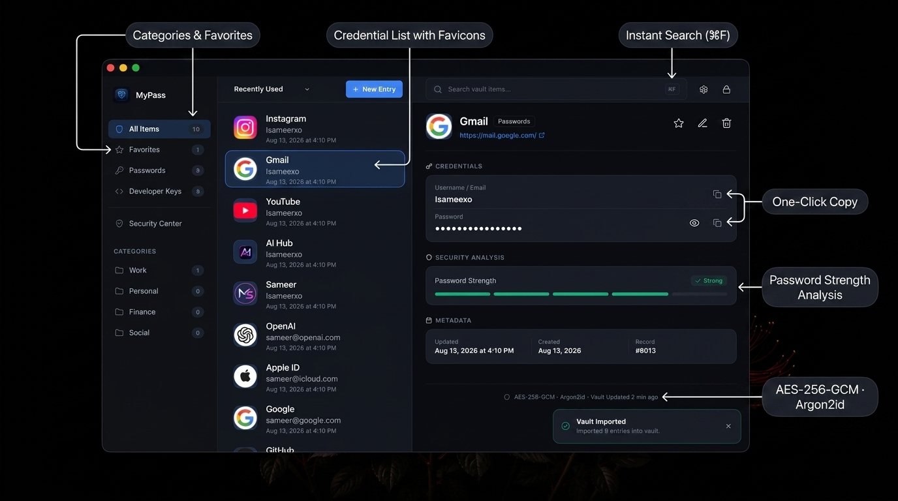
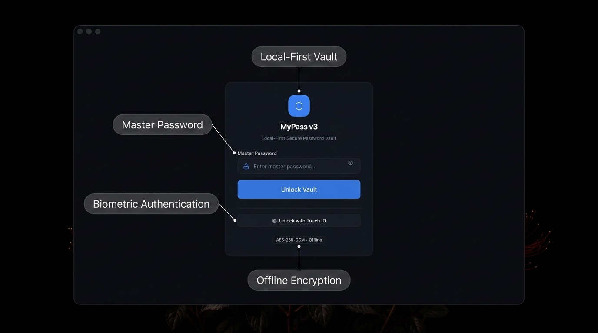
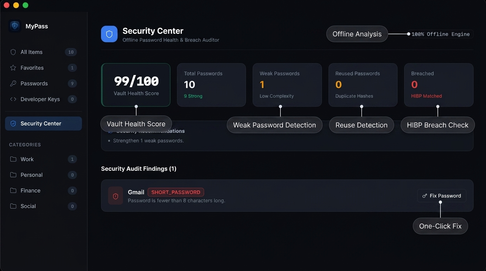
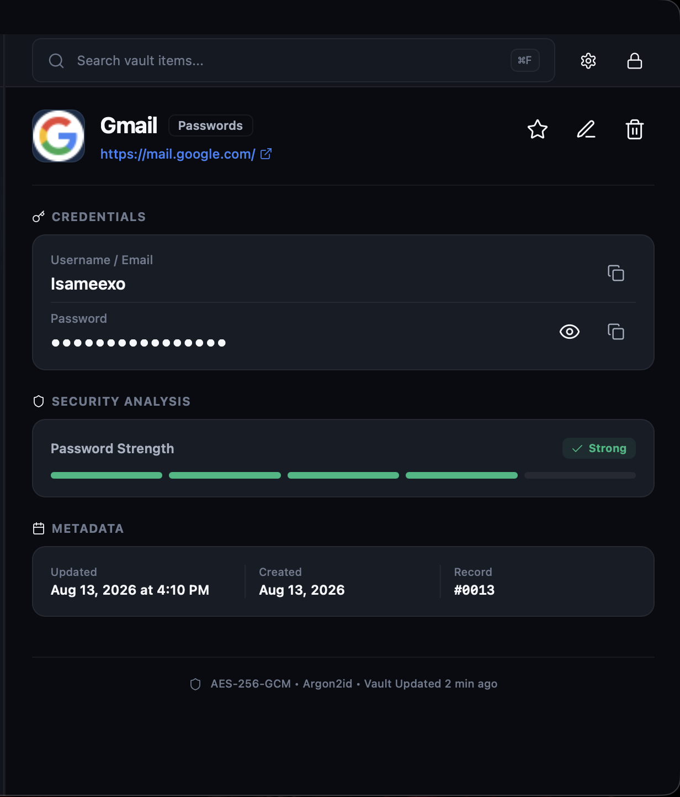
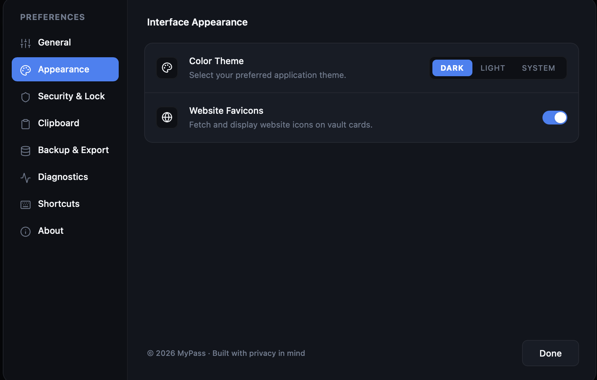

<p align="center">
  
</p>

<h1 align="center">MyPass</h1>

<p align="center">
  A local-first desktop password manager.<br/>
  Your credentials stay on your machine — encrypted, offline, and under your control.
</p>

<p align="center">
  
  
  
  
  
  
</p>

---

## Overview

MyPass is a desktop password manager that stores everything locally. It does not sync to a cloud, does not phone home, and does not require an account.

v3.0.0 is a complete rewrite — from a legacy Python/CustomTkinter application to a modern Tauri + React desktop app with a Python cryptographic backend. The frontend renders through the system's native WebView via Tauri, and the backend runs as a bundled Python process communicating over stdin/stdout IPC.

**Current release:** macOS (Apple Silicon). Windows and Linux backends exist in the codebase but have not been tested or packaged.

---

## 🖥️ Interface

<p align="center">
  
</p>

<p align="center">
  
</p>

<p align="center">
  
</p>

<p align="center">
  
  &nbsp;&nbsp;&nbsp;&nbsp;
  
</p>

<p align="center">
  <em>Entry inspector with strength analysis &nbsp;·&nbsp; Preferences panel</em>
</p>

---

## ✨ Features

### 🗝️ Vault

- Create, edit, and delete credential entries
- Organize by category — Passwords, Secure Notes, Developer Keys, Work, Personal, Finance, Social
- Mark entries as favorites for quick access
- Real-time search and filtering across titles, usernames, and URLs
- Password history tracked per entry

### 🔐 Security

- **AES-256-GCM** encryption for passwords and notes
- **Argon2id** key derivation (64 MB memory, 3 iterations, 4 parallel lanes)
- **Touch ID** biometric unlock on macOS
- Credential storage via the OS keychain
- Auto-lock after inactivity (default: 15 minutes, configurable)
- Clipboard auto-clear after copy (default: 30 seconds, configurable)
- No network access — the app is fully offline

### ⚡ Productivity

- Secure password generator (configurable length, character sets, exclusion rules)
- Password strength indicator — Very Weak through Very Strong
- One-click copy for usernames and passwords
- Command palette — `⌘K`
- Keyboard shortcuts — `⌘N` new entry · `⌘F` search · `⌘L` lock · `⌘,` settings

### 💾 Backup & Auditing

- Encrypted `.mypass` backup export (AES-256-GCM)
- Plaintext JSON export (with explicit warnings)
- Import and merge from backup files
- Native `.mypass` file association — double-click to import
- **Security Center** — offline vault health score, weak password detection, reuse detection, breach flagging

### 🎨 Experience

- Dark, Light, and System theme modes
- Smooth layout animations (Framer Motion)
- Compact mode for dense layouts
- Optional website favicon display
- Resizable panel layout

---

## 🔐 Security Model

MyPass is a password manager, so the security implementation matters. This section describes exactly what is implemented — nothing more.

### Encryption

All sensitive field encryption uses **AES-256-GCM** via the Python `cryptography` library (`cryptography.hazmat.primitives.ciphers.aead.AESGCM`). Each encrypted field uses a unique 12-byte random nonce.

### Key Derivation

The master password is processed through **Argon2id** with these parameters:

| Parameter | Value |
| :--- | :--- |
| Memory | 64 MB (`memory_cost=65536`) |
| Iterations | 3 |
| Parallelism | 4 lanes |
| Output key length | 256 bits (32 bytes) |
| Salt | 16 bytes, random, per-vault |

### What is encrypted at rest

| Data | Encrypted | Method |
| :--- | :--- | :--- |
| Passwords | ✅ Yes | AES-256-GCM, per-entry |
| Notes | ✅ Yes | AES-256-GCM, per-entry |
| Titles | ❌ No | Plaintext in SQLite |
| Usernames | ❌ No | Plaintext in SQLite |
| Website URLs | ❌ No | Plaintext in SQLite |
| Categories | ❌ No | Plaintext in SQLite |
| Tags | ❌ No | Plaintext in SQLite |

This is a deliberate design choice: plaintext metadata enables fast search and filtering without decrypting every entry on each query. The SQLite database file itself is not encrypted at the filesystem level.

### Biometric Authentication

When Touch ID is enabled:

1. A random 32-byte secret is generated and stored in the macOS Keychain
2. The vault's derived master key is encrypted (wrapped) using AES-256-GCM with this secret
3. On biometric unlock, the OS authenticates the user, the secret is retrieved from the Keychain, and the master key is unwrapped
4. The master password itself is never stored anywhere

Biometric authentication is a convenience unlock mechanism — it does not replace or weaken the underlying encryption. The same AES-256-GCM master key protects the vault regardless of how you unlock it.

### Session & Clipboard

- The derived encryption key exists only in the active `VaultService` instance in memory
- Locking the vault destroys the service instance and the key reference
- Auto-lock is driven by frontend inactivity detection (mouse, keyboard, focus, visibility events)
- Clipboard is automatically cleared after a configurable timeout (default: 30 seconds)
- The master password string is explicitly deleted from memory after key derivation

### Backup Encryption

Encrypted `.mypass` backups use AES-256-GCM with a key derived from the master password.

**Security consideration:** The backup key derivation uses a static salt (`mypass_backup_static_salt_v1_000`). This means two vaults with the same master password would produce the same backup encryption key. This trade-off was made so backups can be decrypted portably without requiring the original vault's random salt.

### Current Limitations

- The application is **not code-signed** and **not notarized** by Apple
- The SQLite database file is not encrypted at the filesystem level
- Backup encryption uses a static salt (see above)
- No independent security audit has been performed

---

## 🏗️ Architecture

MyPass uses a hybrid architecture. The Tauri desktop shell hosts a React frontend and manages a bundled Python backend process. The two communicate over **stdin/stdout** using a JSON-RPC protocol — no local network ports are opened.

```
┌─────────────────────────────────────────────┐
│               MyPass.app                    │
│                                             │
│  ┌───────────────────────────────────────┐  │
│  │        React 19 + TypeScript          │  │
│  │     Tailwind CSS · Framer Motion      │  │
│  │       Zustand · React Query           │  │
│  └──────────────────┬────────────────────┘  │
│                     │ invoke("python_ipc")   │
│  ┌──────────────────▼────────────────────┐  │
│  │           Tauri v2 / Rust             │  │
│  │     Native shell · IPC routing        │  │
│  └──────────────────┬────────────────────┘  │
│                     │ stdin/stdout JSON-RPC  │
│  ┌──────────────────▼────────────────────┐  │
│  │      Python Backend (bundled)         │  │
│  │                                       │  │
│  │  Crypto ─── Services ─── Platform     │  │
│  │  AES-GCM    Vault        Auth         │  │
│  │  Argon2id   Backup       Keychain     │  │
│  │             Generator    Touch ID     │  │
│  │             Search                    │  │
│  └──────────────────┬────────────────────┘  │
│                     │                       │
│  ┌──────────────────▼────────────────────┐  │
│  │        SQLite + OS Keychain           │  │
│  │   Per-field encryption at rest        │  │
│  └───────────────────────────────────────┘  │
└─────────────────────────────────────────────┘
```

The Python backend is packaged with PyInstaller in `--onedir` mode and bundled inside the `.app` as a Tauri resource. It starts as a child process on first IPC call and persists for the session.

---

## 🧰 Tech Stack

| Layer | Technology |
| :--- | :--- |
| UI Framework | React 19, TypeScript 5.7 |
| Build Tool | Vite 6 |
| Styling | Tailwind CSS v4 |
| State Management | Zustand 5, TanStack React Query 5 |
| Animations | Framer Motion 12 |
| Icons | Lucide React |
| Validation | Zod |
| Desktop Shell | Tauri v2 (Rust 2021 edition) |
| Backend | Python 3.11+ |
| Encryption | AES-256-GCM (`cryptography` 48.0) |
| Key Derivation | Argon2id |
| Database | SQLite 3 |
| Platform Auth | macOS Keychain + Touch ID, Windows Hello (untested) |
| Sidecar Packaging | PyInstaller 6 (`--onedir`) |

---

## 📦 Installation

### For Users

Download **`MyPass_3.0.0_aarch64.dmg`** from the [Releases](https://github.com/MSameer7-tech/Mypass-V3/releases) page.

**Requirements:** macOS 10.15 (Catalina) or later, Apple Silicon (arm64).

> **Note:** MyPass is not yet code-signed or notarized. macOS will block the first launch. To open it:
> right-click the app → **Open** → click **Open** in the dialog. This only needs to be done once.

Pre-built binaries for Windows and Linux are not currently available.

### Build From Source

**Prerequisites:**

| Tool | Version |
| :--- | :--- |
| Node.js | 20+ |
| pnpm | 11+ |
| Python | 3.11+ |
| Rust | Latest stable |
| PyInstaller | 6+ |

```bash
# Clone
git clone https://github.com/MSameer7-tech/Mypass-V3.git
cd Mypass-V3

# Python backend
cd backend
python -m venv venv
source venv/bin/activate    # Windows: venv\Scripts\activate
pip install -r requirements.txt

# Build the Python sidecar (PyInstaller --onedir)
python build_sidecar.py

# Frontend
cd ../frontend
pnpm install

# Development
pnpm tauri dev

# Production build
pnpm tauri build
```

The production `.dmg` is generated at `frontend/src-tauri/target/release/bundle/dmg/`.

---

## 📁 Project Structure

```
MyPass/
├── backend/
│   ├── ipc_bridge.py               # JSON-RPC stdin/stdout bridge
│   ├── build_sidecar.py            # PyInstaller build script
│   ├── config.py                   # Backend configuration
│   ├── crypto/                     # AES-256-GCM, Argon2id, clipboard
│   ├── database/                   # SQLite schema and operations
│   ├── services/                   # Vault, backup, generator, auth
│   ├── platform_auth/              # macOS, Windows, Linux providers
│   ├── utils/                      # Shared utilities
│   └── tests/                      # pytest suite
├── frontend/
│   ├── src/
│   │   ├── features/               # Auth, security, settings
│   │   ├── components/             # Shared UI components
│   │   ├── stores/                 # Zustand state stores
│   │   ├── api/                    # Tauri IPC client
│   │   └── queries/                # React Query hooks
│   ├── src-tauri/
│   │   ├── src/lib.rs              # Rust IPC bridge, process mgmt
│   │   ├── tauri.conf.json         # App + bundle configuration
│   │   ├── capabilities/           # Tauri permission grants
│   │   └── resources/              # Bundled sidecar (generated)
│   └── package.json
├── contracts/                      # IPC schema definitions (JSON)
├── docs/                           # Architecture, security, IPC docs
├── assets/                         # Icons, branding
├── .github/workflows/ci.yml        # CI pipeline
└── LICENSE
```

---

## 🧪 Testing

```bash
# Backend tests
cd backend
PYTHONPATH=. pytest tests -k "not qtbot"

# Frontend type checking
cd frontend
pnpm typecheck
```

**CI:** GitHub Actions runs both checks automatically on every push and pull request to `main`, `tauri-react`, and `feature/**` branches. CI does not currently build release artifacts.

---

## 🗺️ Roadmap

- [x] Tauri + React desktop rewrite
- [x] Python IPC sidecar architecture
- [x] AES-256-GCM encrypted local vault
- [x] Argon2id key derivation
- [x] macOS Touch ID authentication
- [x] Security Center with vault health scoring
- [x] Encrypted backup/restore (`.mypass` format)
- [x] PyInstaller `--onedir` for fast launch
- [ ] Apple code signing and notarization
- [ ] Master password change
- [ ] Windows packaging and testing
- [ ] Linux packaging and testing
- [ ] Browser extension

---

## ⚠️ Security Notice

MyPass uses established cryptographic primitives (AES-256-GCM, Argon2id) and follows standard practices for local credential storage. However, it is an actively developed personal project and has **not undergone an independent security audit**. Use it with that understanding.

If you discover a security issue, please open a GitHub issue or contact the maintainer directly.

---

## 📄 License

[MIT](LICENSE) — © 2026 Mohammad Sameer

---

## 👨‍💻 Author

**Sameer** — [github.com/MSameer7-tech](https://github.com/MSameer7-tech)

---

<p align="center">
  If MyPass is useful to you, consider giving the repository a ⭐
</p>
