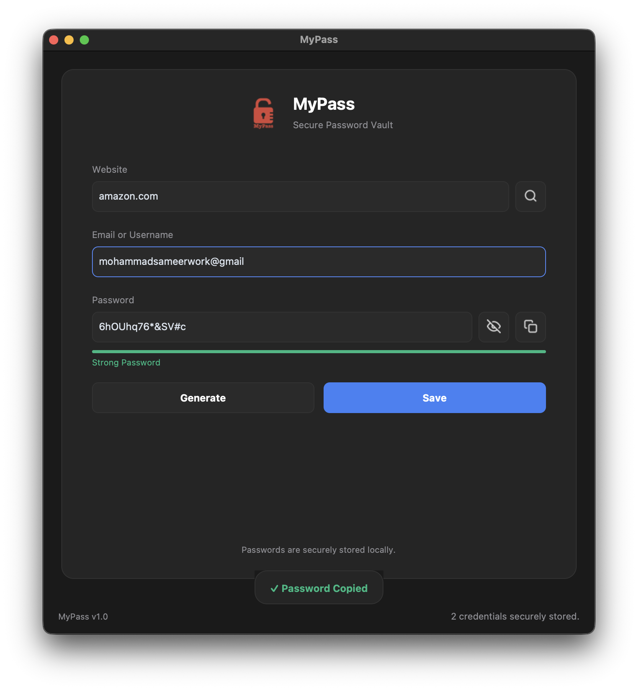
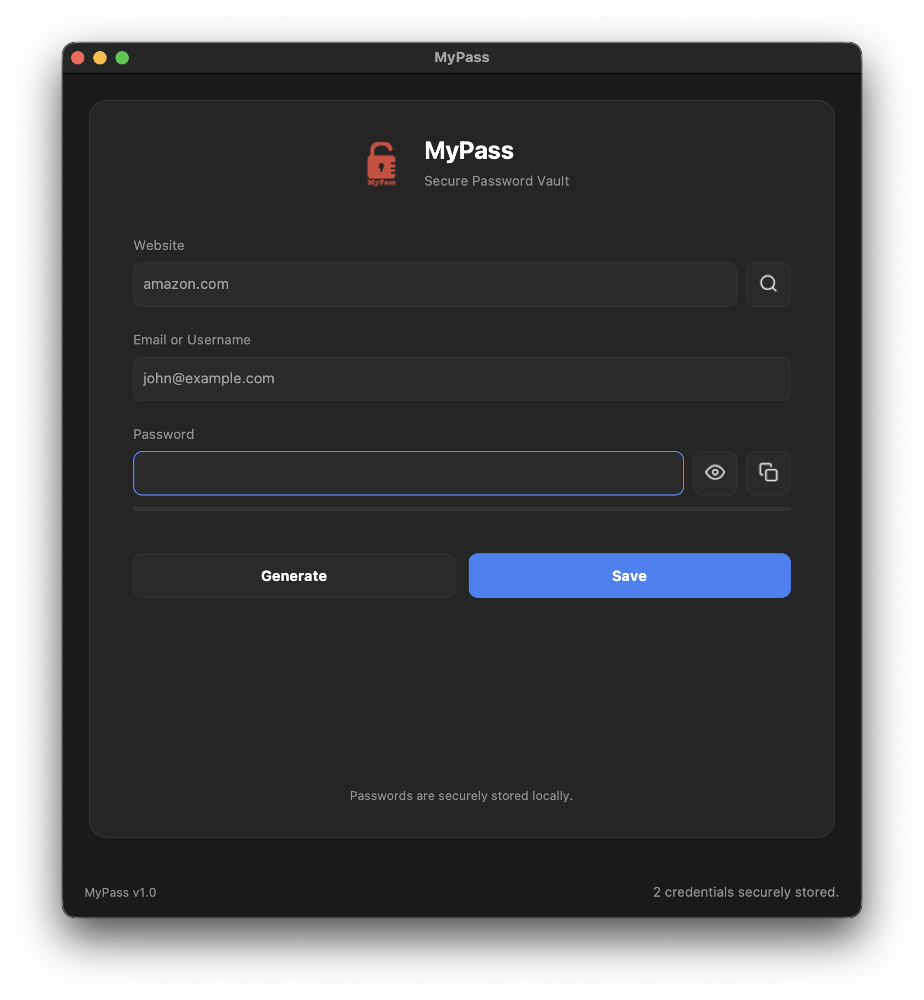
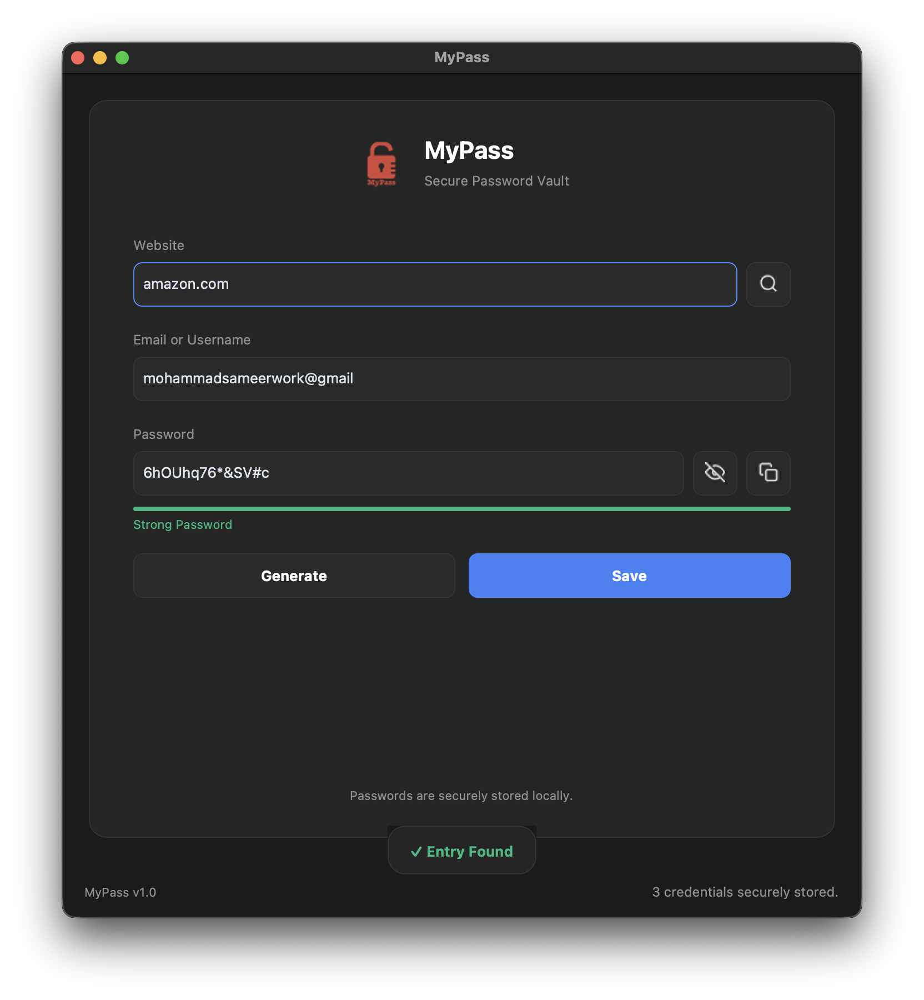

<h1 align="center">🔐 MyPass</h1>

<p align="center">
  <b>Modern AES-encrypted Password Manager for macOS & Windows</b>
</p>

<p align="center">
  
  
  
  
  <br>
  
  
  
  
  
</p>

---

## ✨ Features

- [x] **AES encrypted local password storage**
- [x] **Local SQLite database**
- [x] **Modern CustomTkinter premium UI**
- [x] **Random secure password generator**
- [x] **Password strength indicator**
- [x] **Password search functionality**
- [x] **Show / Hide password toggle**
- [x] **One-click password copy**
- [x] **Real-time UI interactions**
- [x] **Modern matte dark interface**
- [x] **Local-only storage (no cloud)**
- [x] **Cross-platform support**
- [x] **Native macOS DMG installer**
- [x] **Native Windows executable**
- [x] **Automated Windows builds using GitHub Actions**
- [x] **GitHub Releases support**

---

## 📸 Screenshots

### Desktop Preview
<p align="center">
  
</p>

### Password Generation


### Search Functionality
<p align="center">
  
</p>

### Password Strength
<p align="center">
  
</p>

---

## 🛠 Tech Stack

| Technology | Purpose |
|---|---|
| **Python** | Core application |
| **CustomTkinter** | Modern desktop UI |
| **SQLite** | Local database |
| **Cryptography** | AES encryption |
| **PyInstaller** | Packaging |
| **GitHub Actions** | Automated Windows builds |
| **create-dmg** | macOS installer generation |

---

## 🏗 Architecture

```text
       User Interface (CustomTkinter)
                    ↓
            Application Logic
                    ↓
          AES Encryption Layer
                    ↓
          SQLite Secure Vault
```

---

## 📥 Installation

### 🍎 macOS
1. Download `MyPass.dmg` from the **[Releases](../../releases)** page.
2. Open the `.dmg` and drag `MyPass.app` into your Applications folder.
3. If macOS Gatekeeper blocks execution (since this is an unsigned indie app), open your terminal and run:
   ```bash
   xattr -cr /Applications/MyPass.app
   ```

### 🪟 Windows
1. Download `MyPass.exe` from the **[Releases](../../releases)** page.
2. Run the executable.
3. If Windows SmartScreen appears, click **More Info** -> **Run Anyway** because the application is currently unsigned.

---

## 💻 Build from Source

```bash
git clone https://github.com/MSameer7-tech/Password-Manager-App.git
cd Password-Manager-App
pip install -r requirements.txt
python main.py
```

---

## 📦 Packaging

### Build macOS
We use PyInstaller and `create-dmg`:
```bash
pyinstaller --windowed --name "MyPass" --icon assets/icon.icns --add-data "assets:assets" --hidden-import=PIL --hidden-import=customtkinter --hidden-import=cryptography -y main.py

# Fix gatekeeper flags and permissions
xattr -cr dist/MyPass.app
codesign --force --deep -s - dist/MyPass.app

# Create DMG
cd dist
create-dmg --volname "MyPass" --volicon "../assets/icon.icns" --window-pos 200 120 --window-size 800 400 --icon-size 100 --icon "MyPass.app" 200 190 --hide-extension "MyPass.app" --app-drop-link 600 185 "MyPass.dmg" "MyPass.app/"
```

### Build Windows
We use PyInstaller directly from the command prompt:
```cmd
pyinstaller ^
--windowed ^
--name "MyPass" ^
--icon assets\icon.ico ^
--add-data "assets;assets" ^
--hidden-import=PIL ^
--hidden-import=customtkinter ^
--hidden-import=cryptography ^
-y main.py
```
*Note: GitHub Actions can automatically build the Windows executable on every release.*

---

## 🤖 GitHub Actions

The repository automatically generates a Windows executable whenever a new GitHub Release is published. 

This ensures every release contains both:
* `MyPass.dmg`
* `MyPass.exe`

without requiring a Windows machine.

---

## 🚀 Releases

Official installers are available from [GitHub Releases](../../releases).
* 🍎 **macOS** (`.dmg`)
* 🪟 **Windows** (`.exe`)

---

## 🔒 Security

* **Data never leaves the device.**
* **No cloud synchronization.**
* **Passwords remain stored locally.**
* **AES encryption protects sensitive information.**
* **SQLite acts as the secure vault backend.**

---

## 🗺 Roadmap

- [ ] Master Password
- [ ] Touch ID support
- [ ] Auto-lock vault
- [ ] Import / Export
- [ ] Password health dashboard
- [ ] Categories
- [ ] Favorites
- [ ] Secure notes
- [ ] Cloud backup (optional)
- [ ] Android version (future consideration)

---

## 📄 License

This project is licensed under the **MIT License**.

---

<p align="center">
  Built with ❤️ using Python & CustomTkinter<br><br>
  ⭐ If you like this project, consider starring the repository.
</p>
